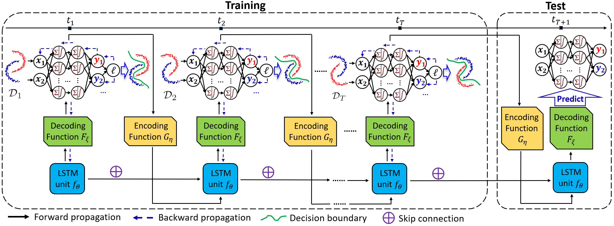

# DRAIN
GitHub Repo for ICLR 2023 (Oral) Paper *"Temporal Domain Generalization with Drift-Aware Dynamic Neural Networks"*

OpenReview link: https://openreview.net/forum?id=sWOsRj4nT1n

Our experiments include both classificaiton and regression datasets. For example, to run our experiments on 2-Moons dataset, go to the "classification" folder and do

1. name model_moons.py as model.py

2. python train.py --dataset Moons

Similar process for other datasets.

The code has been tested with PyTorch and Anaconda.

If you find this code useful in your research, please consider citing:

        @inproceedings{
        bai2023temporal,
        title={Temporal Domain Generalization with Drift-Aware Dynamic Neural Networks},
        author={Guangji Bai and Chen Ling and Liang Zhao},
        booktitle={The Eleventh International Conference on Learning Representations },
        year={2023},
        url={https://openreview.net/forum?id=sWOsRj4nT1n}
        }

